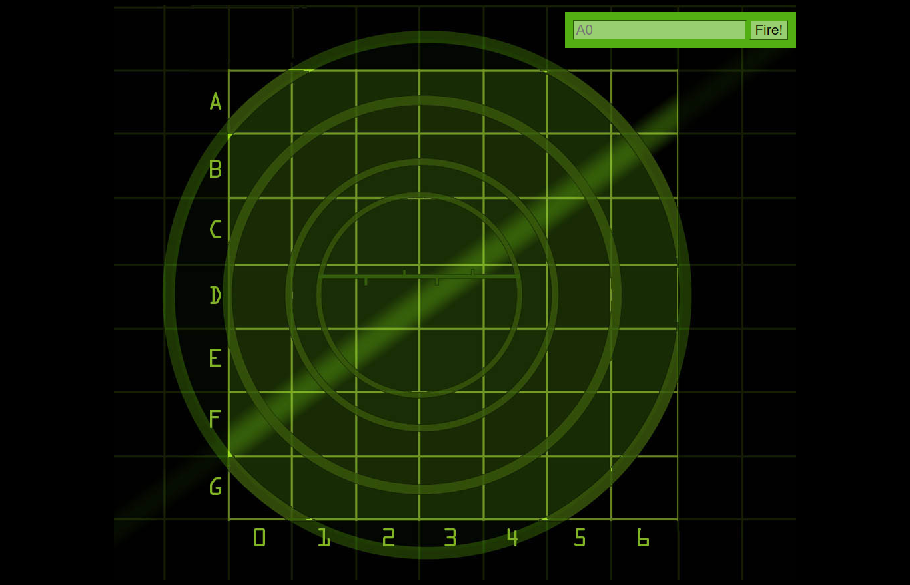

# Head First - Batalha Naval com JS
Essa é uma solução de um dos desafios do livro Head First.

## Tabela de conteúdos
- [Visão Geral](#visao-geral)
  - [O desafio](#o-desafio)
  - [Screenshot](#screenshot)
  - [Links](#links)
- [Meu processo](#meu-processo)
  - [Tecnologias](#tecnologias)
  - [Oque eu aprendi](#oque-eu-aprendi)
  - [Desenvolvimento Continuo](#development-continuo)
- [Autor](#autor)


## Visão Geral

### O desafio
O usuário que acessar o jogo deve ser capaz de: 
- Ver o campo de batalha;
- Digitar o número de sua escolha no input (desde que seja de 0 á 6 e de A á G);
- Jogar novamente, tanto se tiver errado ou acertado;
- Continuar a jogar até que tenha abatido todos os navios;

O jogo deve ser capaz de:
- Enviar um retorno ao usuário se acertou um navio ou se errou;
- Enviar um retorno ao usuário informando que ganhou o jogo e quantas tentativas foram;
- Rodar a lógica do jogo normalmente, sem falhas;
- Avisar ao jogador que o seu input é inválido;


### Screenshot




### Links

- Live Site URL: [Batalha Naval com JS](https://julio-henrique.github.io/batalha-naval-js/)


## Meu processo

### Tecnologias

- HTML
- CSS
- Javascript


### Oque eu aprendi

Esse projeto ainda foi quando eu estava aprendendo JS e ele foi, fantástico, com ele que eu finalmente aprendi programação orientada a objetos (POO).
Com a POO você pode fazer um código bem mais eficiente, fácil de entender e fácil de dar manutenção.
Nós separamos o código, fica bem limpo, tão bom que mesmo depois de um bom tempo, eu consigo entender perfeitamente o código e o jogo :D

Você pode claramente ver que temos 3 principais objetos:
- Model
- View
- Controller

**Model**
De forma mais simplificada, é o *modelo* do jogo;
Cuida da parte do jogo, fazer as suas tentativas, quantos navios estarão em campo;
Onde os navios estão e armazena os navios em um array;
O tamanho do tabuleiro e onde os navios vão nascer;
Essa parte foi a mais "trabalhosa".

**View**
É a *Visão* do jogo, aqui ficam todas as respostas/retornos para o jogador;
Se atingiu um navio, se errou o tiro.

**Controller**
Aqui fica o *controle* do jogo.
Aqui se defini se o jogo termina e claro, quando termina também mostramos quantas tentativas levou para que o jogador conseguisse finalizar.

Abaixo alguns pontos que eu gostei muito, serviu de aprendizado (o projeto todo foi um GRANDE APRENDIZADO) e que eu preferi destacar.

```js
const model = {
    generateShipLocations: function() {
        let locations
        for (let i = 0; i < this.numShips; i++) {
            do {
                locations = this.generateShip() 
            } while (this.collision(locations))
            this.ships[i].locations = locations
        }
        console.log("ships array: ")
        console.log(this.ships)
    }
}
```
Essa função foi bem interessante de fazer, geramos os navios de forma aleatória
```js
const model = {
    generateShip: function() {
        let direction = Math.floor(Math.random() * 2)
        let row, col

        if (direction === 1) { // Horizontal
            row = Math.floor(Math.random() * this.boardSize)
            col = Math.floor(Math.random() * (this.boardSize - this.shipLength + 1))
        } else {
            row = Math.floor(Math.random() * (this.boardSize - this.shipLength + 1))
            col = Math.floor(Math.random() * this.boardSize)
        }
            
        let newShipLocations = []
        for (let i = 0; i < this.shipLength; i++) {
            if (direction === 1) {
                newShipLocations.push(row + "" + (col + i))
            } else {
                newShipLocations.push((row + i) + "" + col)
            }
        }
        return newShipLocations
    }
}
```
E aqui a continuação


Trabalhar com o `this` também foi um grande aprendizado.

Mas acima de tudo ver como `methods` podem ser usados de forma fácil e simples, realmente objetos fazem coisas incriveis

### Desenvolvimento Continuo


## Author

- Linkedin - [Julio Henrique](https://www.linkedin.com/in/julio-henriqueCS/)
- Email - juliohjesus@gmail.com
